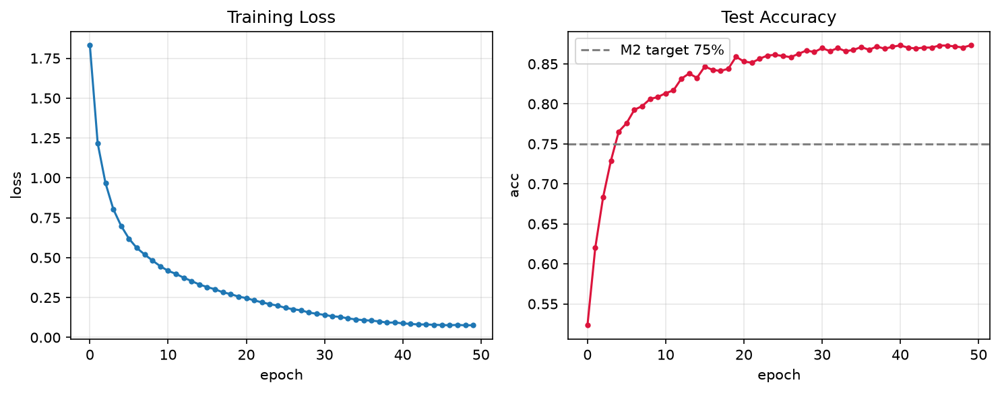

# M2: CIFAR-10 Classification from Scratch

10-class image classification on CIFAR-10 (50k train / 10k test, 32×32 RGB).

## Model
Custom CNN, 3 convolutional blocks (VGG-style 3×3 kernels with padding=1):

| Block | Layers | Output shape |
|---|---|---|
| 1 | Conv(3→64)×2 + BN + ReLU + MaxPool | 16×16×64 |
| 2 | Conv(64→128)×2 + BN + ReLU + MaxPool | 8×8×128 |
| 3 | Conv(128→256) + BN + ReLU + MaxPool | 4×4×256 |
| Head | Flatten + Linear(4096→10) | 10 |

## Training
- Optimizer: SGD (lr=0.01, momentum=0.9, weight_decay=5e-4)
- Scheduler: CosineAnnealingLR (T_max=50)
- Loss: CrossEntropyLoss | Batch size: 64 | Epochs: 50
- Augmentation: RandomCrop(32, padding=4) + RandomHorizontalFlip
- Normalization: CIFAR-10 mean/std

## Results
**Best test accuracy: 87.33%** (target: 75%)

## Troubleshooting
| Issue | Cause | Fix |
|---|---|---|
| acc stuck at 10% | lr=0.1 too large for BN net | lr=0.01 |
| `Input type ... should be the same` | model on GPU, data on CPU | `map_location="cpu"` or `.to(device)` |
| `'int' object has no attribute 'to'` | iterating Dataset instead of DataLoader | use `train_loader` |
| `UnpicklingError: Weights only load failed` | PyTorch 2.6+ default `weights_only=True` | use `state_dict` |

## Note
Numbers above are from a real run, not copied from any tutorial.
